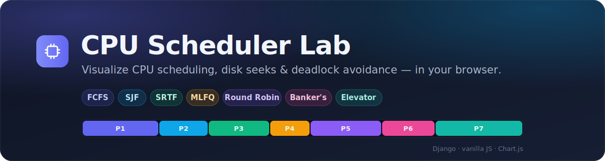

<div align="center">



<br>

# CPU Scheduler Lab

### An interactive Django playground for operating-system scheduling algorithms

Add processes, pick an algorithm, and watch the **animated Gantt chart**, timing
metrics, and step-by-step results render live — in a clean light/dark UI.

<br>


</div>

---

## ✨ Overview

CPU scheduling decides **which process runs next** and for **how long** — a core
responsibility of every operating system. This project turns that abstract idea
into something you can *see*: enter a set of processes, run an algorithm, and
the app computes the schedule on a per-tick timeline and visualizes it.

It covers classic CPU schedulers, plus two related OS problems — **disk-arm
scheduling** (the elevator algorithm) and **deadlock avoidance** (Banker's
algorithm) — under one cohesive interface.

> 🎓 Built as a learning tool: the goal is correctness you can trust and
> visuals that make the *why* obvious.

---

## 🧠 Algorithms

| Algorithm | Type | Preemptive | The idea |
|-----------|------|:----------:|----------|
| **FCFS** — First-Come, First-Served | CPU | ❌ | Run jobs in order of arrival. |
| **SJF** — Shortest Job First | CPU | ❌ | Pick the shortest *available* burst next. |
| **SRTF** — Shortest Remaining Time First | CPU | ✅ | Preempt whenever a shorter job arrives. |
| **Round Robin** | CPU | ✅ | Cycle through jobs, one time-quantum each. |
| **MLFQ** — Multi-Level Feedback Queue | CPU | ✅ | Priority queues + demotion on quantum expiry. |
| **Banker's Algorithm** | Deadlock | — | Search for a *safe sequence* before granting resources. |
| **Elevator (LOOK)** | Disk | — | Sweep the disk arm one direction, then reverse. |

Every CPU scheduler reports **completion**, **turnaround**, **waiting**, and
**response** times, the **averages**, and a full **Gantt chart**.

---

## 🖥️ Features

- 🎬 **Animated Gantt charts** — per-process colors, idle slots, and a time axis.
- 📊 **Live metrics** — count-up stat tiles for waiting/turnaround/response.
- 🌗 **Light & dark themes** — toggle in the nav, remembered across visits, with no flash on load.
- ➕ **Manage processes** — add/remove jobs (name, arrival, burst, priority) backed by a SQLite database.
- 🏦 **Banker's verdict** — safe/unsafe result with the computed safe sequence and Need/Allocation/Available matrices.
- 🛗 **Elevator chart** — total seek distance and the head-movement path drawn with Chart.js.
- ⚡ **No build step** — server-rendered Django templates + vanilla JS.

---

## 🚀 Quick start

> **Prerequisites:** Python 3.10+ (3.12 recommended) and `git`.

```bash
# 1. Clone
git clone https://github.com/Hesamtht/cpu-scheduling-algorithms.git
cd cpu-scheduling-algorithms

# 2. Create & activate a virtual environment
python -m venv venv
#   Windows (PowerShell):
venv\Scripts\Activate.ps1
#   macOS / Linux:
source venv/bin/activate

# 3. Install dependencies
pip install -r requirements.txt

# 4. Apply database migrations
python manage.py migrate

# 5. Run the development server
python manage.py runserver
```

Then open **<http://127.0.0.1:8000/>** in your browser. 🎉

---

## 🧭 Using the app

1. Open a page from the top navigation (**Scheduler**, **Round Robin**, **MLFQ**, **Banker's**, **Elevator**).
2. **Add processes** with their arrival time, burst time, and (for MLFQ) priority.
3. For Round Robin, set the **time quantum**; for the elevator, the request list.
4. Click **Run** — the Gantt chart animates and the metrics fill in.
5. Use the ☀️/🌙 toggle to switch themes anytime.

### Routes

| Page | URL | API endpoint(s) |
|------|-----|-----------------|
| Scheduler (FCFS / SJF / SRTF / MLFQ) | `/` | `POST /schedule/`, `add_process/`, `delete_process/<id>/` |
| Round Robin | `/round_robin/` | `POST /round_robin_schedule/` |
| MLFQ | `/mlfq/` | `POST /mlfq_schedule/`, `mlfq_add_process/` |
| Banker's Algorithm | `/banker/` | `POST /run_banker/` |
| Elevator (Disk) | `/elevator/` | `POST /run_elevator/` |

---

## 🗂️ Project structure

```
cpu-scheduling-algorithms/
├─ manage.py
├─ requirements.txt
├─ my_site/                     # Django project config
│  ├─ settings.py
│  └─ urls.py                   # includes scheduler.urls
├─ scheduler/                   # main application
│  ├─ algorithms.py             # ← all scheduling logic lives here
│  ├─ views.py                  # request handlers + JSON APIs
│  ├─ models.py                 # Process model
│  ├─ urls.py
│  ├─ templates/scheduler/      # base.html + one page per algorithm
│  └─ static/scheduler/         # app.css (design system) · app.js (Gantt/stats/theme)
└─ assets/
   └─ banner.svg
```

The `Process` model is intentionally tiny:

```python
class Process(models.Model):
    name = models.CharField(max_length=100)
    arrival_time = models.IntegerField()
    burst_time   = models.IntegerField()
    priority     = models.IntegerField(default=0)
```

---

## 🛠️ Tech stack

| Layer | Tools |
|-------|-------|
| Backend | Django 5.2, Python 3.12 |
| Scheduling math | Pure Python + NumPy (Banker's matrices) |
| Frontend | Server-rendered templates, vanilla JS, Chart.js |
| Styling | Custom CSS design system with light/dark themes |
| Database | SQLite |

---

## 🤝 Contributing

Contributions are welcome! Open an issue to discuss a change, or send a PR:

```bash
git checkout -b feature/your-idea
# make changes
git commit -m "Add your idea"
git push origin feature/your-idea
```

Ideas: priority scheduling, more disk algorithms (SCAN/C-SCAN/SSTF),
exportable reports, or a process-set import/export.

---

## 📄 License

No license file is currently included — the project is shared for **educational
use**. If you plan to reuse it, please add a license (e.g. [MIT](https://choosealicense.com/licenses/mit/)) first.

<div align="center">
<br>
<sub>Made with Django for learning operating-system concepts.</sub>
</div>
